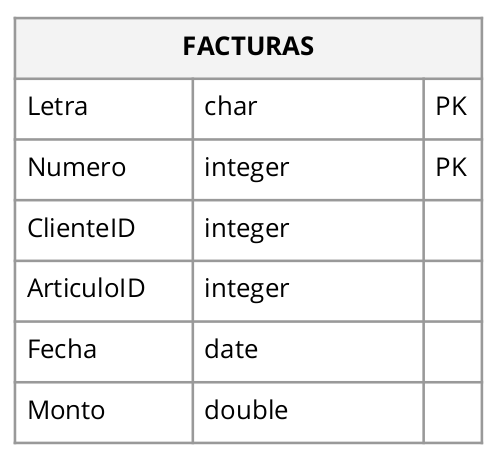
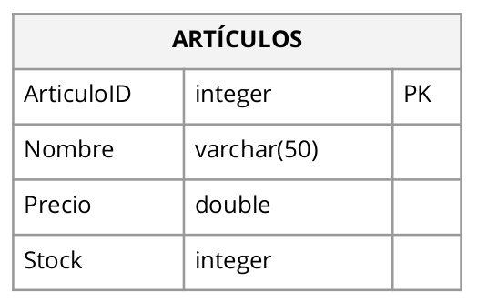
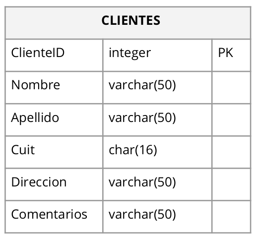

[Inicio](../../README.md)
# Modulo 1
## [Laboratorio 1](1-laboratorio.sql)
1. Eliminar si existe la base de datos Laboratorio.
1. Crear la base de datos Laboratorio.
1. Crear la tabla Facturas dentro de la base de datos con la siguiente estructura:

    
    1. PK significa Primary Key.
    1. Observar que se está declarando una clave primaria compuesta, es decir (Letra, Número), cada campo por sí solo no es clave, ni tampoco identifica al registro, pero la combinación de los dos forman la clave.
1. Crear la tabla Artículos dentro de la base de datos con la estructura del ejemplo.

    
1. Crear la tabla Clientes dentro de la base de datos con la estructura del ejemplo.

    
1. Cargar 5 registros en las tablas Facturas, Artículos y Clientes.