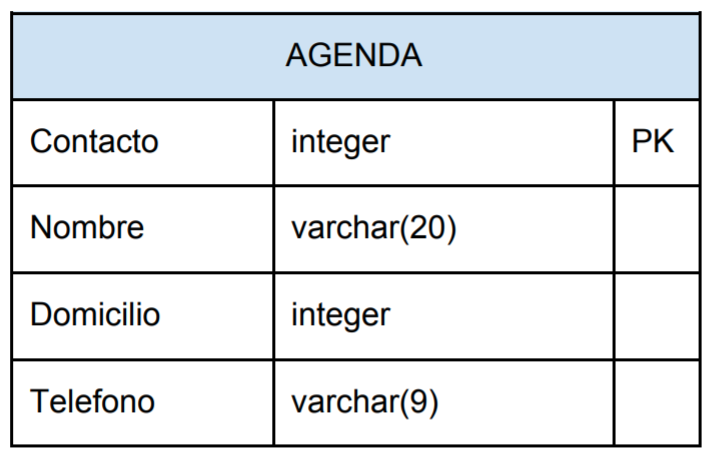
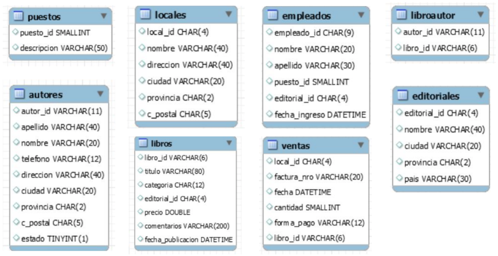
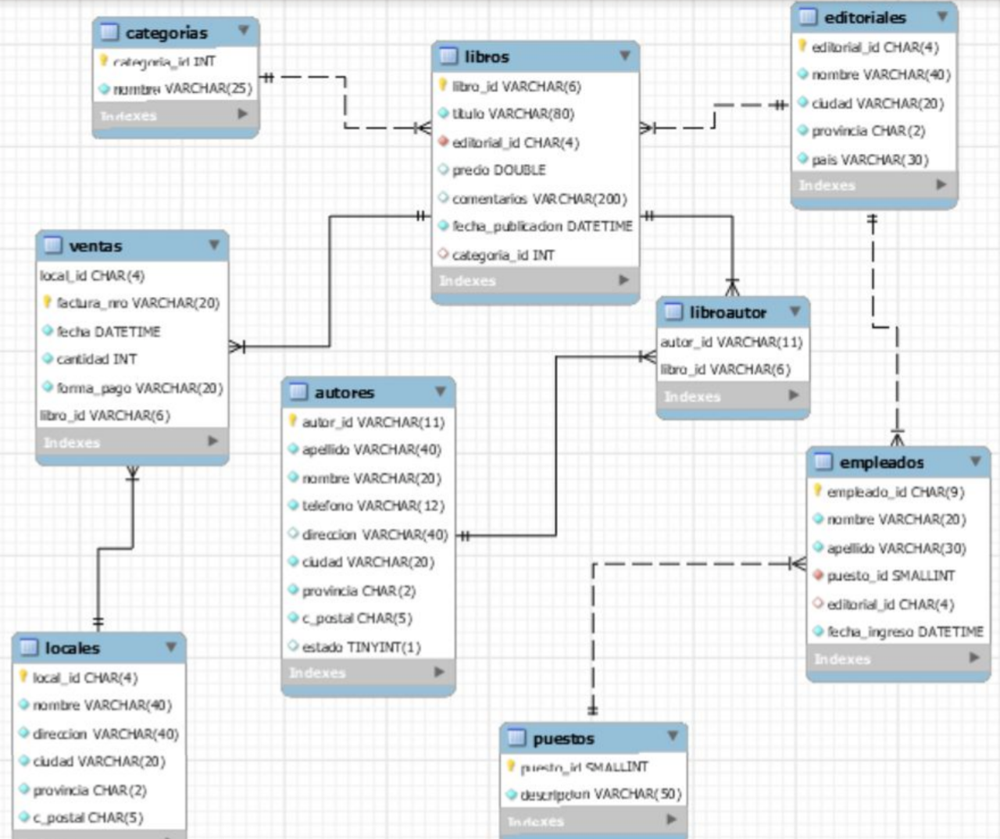

[Inicio](../../README.md)
# Modulo 1
## [Laboratorio 1](1-laboratorio.sql)
1. Eliminar si existe la base de datos Laboratorio.
1. Crear la base de datos Laboratorio.
1. Crear la tabla Facturas dentro de la base de datos con la siguiente estructura:

    
    1. PK significa Primary Key.
    1. Observar que se está declarando una clave primaria compuesta, es decir (Letra, Número), cada campo por sí solo no es clave, ni tampoco identifica al registro, pero la combinación de los dos forman la clave.
1. Crear la tabla Artículos dentro de la base de datos con la estructura del ejemplo.

    
1. Crear la tabla Clientes dentro de la base de datos con la estructura del ejemplo.

    
1. Cargar 5 registros en las tablas Facturas, Artículos y Clientes.

## [Bonus 1](1-bonus.sql)
1. Elimine la tabla "agenda", si existe:
    * Puede eliminar la tabla usando el navegador gráfico ubicado a la izquierda en workbench, o ejecutar la siguiente sentencia:

    ```sql
    DROP TABLE IF EXISTS agenda;
    ```
1. Cree una tabla llamada "agenda". Debe tener la siguiente estructura:

    
1. Visualice las tablas existentes en la base de datos para verificar la creación de "agenda".

    > Nota: Puede visualizar el listado de tablas usando el navegador gráfico ubicado a la izquierda en workbench, o ejecutar el siguiente comando:

    ```sql
    SHOW TABLES;
    ```
1. Visualice la estructura de campos de la tabla "agenda".

    > Nota: Puede visualizar la estructura de la tabla usando el navegador gráfico ubicado a la izquierda en workbench, o ejecutar el siguiente comando:

    ```sql
    DESCRIBE agenda;
    ```
1. Ingrese 3 registros en la tabla Agenda.
1. Seleccione y muestre todos los registros de la tabla.
1. Elimine la tabla "agenda", si existe.

## [Bonus Track 1: Construyendo bases de datos y tablas](1-bonus-track.sql)
1. Crear una base de datos llamada _librería_. La misma estará conformada por 8 tablas, las cuales tendrán la siguiente estructura:

    

1. Crear cada una de las tablas utilizando la sentencia _CREATE_ del subconjunto de sentencias DDL (Data Definition Language) del lenguaje SQL.
1. Una vez creadas todas las tablas, insertar un conjunto de registros en cada una de ellas, utilizando el script provisto en la sección de descargas.
1. Luego de insertar los registros, definir claves primarias (Primary Key) en cada tabla teniendo en cuenta que cada tabla tiene un campo con sufijo _“\_id”_ que identifica al campo clave. Asimismo, la lógica de negocio indica que un mismo número de factura se puede repetir en varios locales y en un mismo local, pero con distintos códigos de libros, y la combinación de autor/libro es única.
1. Examinemos los datos ingresados e insertemos 3 registros en cada una de las tablas, utilizando la sentencia INSERT del subconjunto de sentencias DML (Data Manipulation Language) del lenguaje SQL.

# Modulo 2
## [Laboratorio 2](2-laboratorio.sql)
1. Llenar las tablas artículos clientes y facturas con 5 registros cada una.
1. Basándose en la tabla artículos obtener los siguientes listados.
    1. artículos con precio mayor a 100
    1. artículos con precio entre 20 y 40 (usar < y >)
    1. artículos con precio entre 40 y 60 (usar BETWEEN)
    1. artículos con precio = 20 y stock mayor a 30
    1. artículos con precio (12,20,30) no usar IN
    1. artículos con precio (12,20,30) usar el IN
    1. artículos cuyo precio no sea (12,20,30)
1. Listar los artículos ordenados por precio de mayor a menor, y si hubiera precios iguales deben quedar ordenados por nombre.
1. Listar todos los artículos incluyendo una columna denominada precio con IVA, la cual deberá tener el monto con el iva del producto.
1. Listar todos los artículos incluyendo una columna denominada “cantidad de cuotas” y otra “valor de cuota”, la cantidad es fija y es 3, el valor de cuota corresponde a 1/3 del monto con un 5% de interés.
## [Laboratorio 2 Adicional](2-laboratorio-adicional.sql)
1. Seleccionar todos los registros de la tabla Articulos.
1. Mostrar los artículos con precio menor o igual a 50.
1. Seleccionar los artículos cuyo precio sea mayor o igual a 500.
1. Seleccionar los artículos cuyo stock sea menor a 30.
1. Seleccionar el nombre y descripción de los artículos que no cuesten $100:
1. Obtener un listado de los productos que contengan una letra “a”.
1. Obtener un listado de artículos cuyo precio se encuentre entre 100 y 200 pesos.
1. Obtener un listado de artículos con precio con IVA menor a 100.
1. Obtener un listado de artículos cuyo stock sea menor a 10 y precio con iva mayor a 200.
1. Obtener un listado de artículos que pagaderos en 3 cuotas sin interes, tenga un valor de cuota menor a 50$

## [Bonus 2](2-bonus.sql)
1. Listar empleados ordenados por apellido.
1. Listar nombre y apellido (en una sola columna), y fecha de ingreso de empleados ordenados por fecha de ingreso, de la más actual a la más antigua.
1. Listar nombre y apellido (en una sola columna llamada “Empleado”), y año de ingreso de empleados ordenados por año de ingreso, del más antiguo al más actual.
1. Listar inicial del nombre y apellido (en una sola columna llamada “Empleado”), y año de ingreso de los empleados ingresados en el segundo semestre del año 1989.
1. Listar empleados ordenados por sexo, teniendo en cuenta que el dato correspondiente al sexo está dado por la última letra del campo empleado_id
1. Listar empleadas mujeres pertenecientes a la editorial 0736
1. Listar autores nacidos fuera de la provincia de Buenos Aires (BA) y de la Ciudad de Buenos Aires.
1. Listar novelas publicadas antes del año 2000.
1. Listar libros sin precio asignado.
1. Listar libros ordenados por categoría, sólo para categorías conocidas.
1. Listar locales que contengan la palabra “librería” como parte de su nombre.
1. Listar libros agregando una columna que tenga el precio de cada libro incrementado en un 51%, una columna con el precio con un descuento del 10% y una columna, con el valor de cuota en caso de venderse en 6 cuotas con un recargo del 25%. Dar a cada columna calculada una misma precisión decimal.
1. Listar libros que contengan las palabras “de” ó “del” en el nombre.
1. Listar ventas registradas en el primer semestre de cualquier año cuyo método de pago no sea transferencia ni efectivo

# Modulo 3
## [Laboratorio 3: Funciones](3-laboratorio.sql)
1. Obtener el monto máximo de factura.
2. Obtener el monto mínimo de factura.
3. Obtener el monto mínimo de factura entre los años 2011 y 2020.
4. Obtener el monto promedio de factura.
5. Obtener la factura con el monto promedio del año 2011.
6. Obtener la cantidad de facturas.
7. Obtener la cantidad de facturas que tienen un monto entre $500 y $3.300.
8. Obtener la cantidad de facturas que hay en cada año.
9. Obtener la cantidad de facturas y el monto promedio en cada año.
10. Obtener la suma del monto y el promedio de las facturas según la letra.

## [Bonus 3: Resumiendo y agrupando información](3-bonus.sql)
1. Listar cantidad de empleados.
2. Listar cantidad de empleados de sexo masculino.
3. Listar cantidad de autores de la provincia de Buenos Aires (BA).
4. Listar cantidad de libros por autor.
5. Listar cantidad de libros que no sean novelas.
6. Listar cantidad de libros con precio mayor a 15.
7. Listar cantidad de locales con código que comience con 7.
8. Listar cantidad de libros por factura.
9. Listar cantidad de unidades vendidas por libro.
10. Listar cantidad de facturas por local.
11. Listar cantidad de unidades vendidas por forma de pago.
12. Listar cantidad de libros, precio máximo, precio mínimo, promedio de precio por categoría.
13. Listar cantidad de libros, precio máximo, precio mínimo, promedio de precio por año de publicación.
14. Listar precio máximo por editorial.
15. Listar cantidad de libros sin precio por editorial.

# Modulo 4
## [Laboratorio 4: Modificación de estructuras](4-laboratorio.sql)
1. Agregar la relación (FK) entre la tabla _Facturas_ y la tabla _Clientes_.
1. Agregar la relación (FK) entre la tabla _Facturas_ y la tabla _Articulos_.
1. Generar un error de FK en la tabla _Facturas_.
1. Agregar la columna _CPostal_ a la tabla _Clientes_.
1. Eliminar la columna _CPostal_ de la tabla _Clientes_.

## [Laboratorio Adicional 4: Consultas relacionadas](4-lab-adicional.sql)
1. Informar nombre y apellido de los clientes que han realizado compras.
1. Informar nombre y apellido de los clientes que tienen facturas con monto mayor a 2000 pesos.
1. Informar letra y número de factura, el nombre y el precio de los artículos que se han vendido.
1. Informar el precio máximo y mínimo de los artículos facturados con letra A.
1. Informar la cantidad de facturas, nombre y apellido de cada cliente.
1. Informar el promedio de venta para los artículos con precio >10.
1. Informar nombre y apellido y total de monto de facturas por año para cada cliente.
1. Informar qué facturas fueron emitidas al cliente Diaz.
1. Informar el total vendido por artículo.
1. Informar nombre y apellido del cliente que más ha comprado.

## [Bonus Track 4: Modificando estructuras de tablas](4-bonus.sql)
Si examinamos los datos guardados en las tablas, podremos observar que existen datos que pueden ser desconocidos o vacíos, sin que esto afecte la consistencia de la información. Existen otros que, por su naturaleza, deberían ser obligatorios, por lo que procederemos a exigir la existencia de valores en esa columna a partir de la característica NOT NULL en los casos correspondientes.

1. Crear cada una de las restricciones NOT NULL utilizando la sentencia ALTER del subconjunto de sentencias DDL (Data Definition Language) del lenguaje SQL.

Teniendo en cuenta que no es recomendable tener información de una entidad en una tabla que no guarda datos de esa entidad (nombre de las categorías o géneros literarios en la tabla de libros), crearemos una tabla llamada categorías con un valor de id generado automáticamente por el motor de base de datos y el nombre correspondiente a cada una de ellas.

2. Crear la tabla categorías y llenarla con los datos existentes en la tabla de libros en el campo correspondiente.
3. A continuación, agregar una columna llamada categoría_id de tipo número entero en la tabla libros utilizando la sentencia ALTER del subconjunto de sentencias DDL (Data Definition Language) del lenguaje SQL.

Esta nueva columna guardará el valor traído desde la tabla categorías utilizando la sentencia UPDATE del subconjunto de sentencias DML (Data Definition Language) del lenguaje SQL.

Una vez completadas todas las actualizaciones, eliminaremos la columna categoría de la tabla libros utilizando la sentencia ALTER del subconjunto de sentencias DDL del lenguaje SQL.

Uno de los puntos más importantes en el diseño de una base de datos es la __Integridad Referencial__, un mecanismo que es recomendable implementar para garantizar la inexistencia de datos huérfanos (por ejemplo, la existencia de un libro en la tabla de libros cuya editorial no exista en la tabla de editoriales, ó una venta en cual se haya vendido un libro inexistente en la tabla de libros ó realizado en un local que no existe).

4. Agregar a las tablas cada una de las restricciones de integridad referencial a partir de la creación de claves externas o foráneas (FOREIGN KEY) utilizando la sentencia ALTER del subconjunto de sentencias DDL (Data Definition Language) del lenguaje SQL y estableciendo cuál será el comportamiento de esas claves en caso de producirse una modificación en los valores de sus correspondientes claves primarias, a través de la especificación ON UPDATE.

5. Finalmente procederemos a crear un Diagrama de base de datos utilizando la herramienta de ingeniería inversa de MySql Workbench, disponible en la opción de menú “Database”.



Enriqueciendo información a partir de consultas desde varias tablas. A varias de las consultas agrupadas le agregaremos datos para su mayor comprensión.

1. Listar cantidad de libros por autor (agregar a la consulta id, nombre, apellido y ciudad del autor).
1. Listar cantidad de libros que no sean novelas (agregar a la consulta id y nombre de la categoría).
1. Listar cantidad de locales con código que comience con 7 (agregar todos los datos de los locales).
1. Listar cantidad de unidades vendidas y calcular el monto total por libro (agregar título y precio del libro).
1. Listar cantidad de facturas por local (agregar todos los datos de los locales).
1. Listar cantidad de libros, precio máximo, precio mínimo, promedio de precio por categoría (agregar id y nombre de la categoría).
1. Listar precio máximo por editorial (agregar nombre y país de la editorial).
1. Listar cantidad de libros sin precio por editorial (agregar nombre, ciudad y provincia de la editorial).